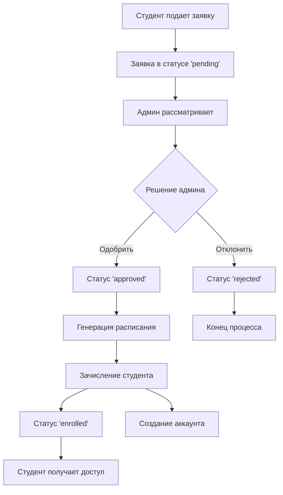

# Руководство по функциональности регистрации студентов

## 🎯 Обзор новой функциональности

Реализована полная система регистрации студентов с интерактивным процессом:
- **Студенты** самостоятельно подают заявки на обучение
- **Админы** рассматривают заявки и принимают решения
- **Автоматическая генерация** индивидуального расписания
- **Умная система зачисления** с созданием аккаунтов

## 🔧 Реализованные компоненты

### Backend
- ✅ `studentRegistration-controller.js` - контроллер для управления заявками
- ✅ `studentRegistrationSchema.js` - схема данных для заявок
- ✅ Новые API endpoints в `routes/route.js`
- ✅ Обновленная схема `studentSchema.js` с дополнительными полями

### Frontend
- ✅ `StudentRegistrationForm.js` - пошаговая форма подачи заявки
- ✅ `StudentRegistrations.js` - админ панель для работы с заявками
- ✅ Обновленная навигация в админ панели
- ✅ Новые карточки на странице выбора пользователя

## 🚀 Как тестировать

### 1. Запуск системы
```bash
# Backend
cd backend
npm install
npm start

# Frontend
cd frontend
npm install
npm start
```

### 2. Подача заявки студентом

1. Перейдите на `http://localhost:3000`
2. Нажмите "Войти в систему"
3. Выберите карточку "Регистрация студента"
4. Заполните 7-шаговую форму:
   - **Шаг 1**: Личная информация
   - **Шаг 2**: Информация о родителях
   - **Шаг 3**: Предыдущее образование
   - **Шаг 4**: Выбор школы, класса и предметов
   - **Шаг 5**: Предпочтения расписания
   - **Шаг 6**: Дополнительная информация
   - **Шаг 7**: Документы (необязательно)

### 3. Работа админа с заявками

1. Войдите как админ в систему
2. В боковом меню выберите "Регистрации студентов"
3. Вы увидите:
   - **Статистику** по заявкам
   - **Вкладки** по статусам заявок
   - **Таблицу** с возможностями:
     - 👁️ Просмотр деталей заявки
     - ✅ Одобрение заявки
     - ❌ Отклонение заявки
     - 📅 Генерация расписания
     - 👤 Зачисление студента

### 4. Процесс одобрения заявки

1. **Просмотр**: Нажмите иконку глаза для детального просмотра
2. **Одобрение**: Нажмите зеленую галочку, добавьте комментарий
3. **Генерация расписания**: После одобрения создайте индивидуальное расписание
4. **Зачисление**: Назначьте номер студента и создайте аккаунт

## 📊 API Endpoints

### Студенческие регистрации
```http
POST   /student-registration                    # Подача заявки
GET    /student-registrations/:schoolId         # Список заявок школы
GET    /student-registration/:registrationId    # Детали заявки
PUT    /student-registration/:id/status         # Обновление статуса
POST   /student-registration/:id/generate-schedule  # Генерация расписания
POST   /student-registration/:id/create-student     # Создание студента
PUT    /student-registration/:id/reject              # Отклонение заявки
GET    /student-registrations/:schoolId/stats        # Статистика
```

## 🎨 UI/UX Особенности

### Форма регистрации
- **Пошаговый интерфейс** с прогресс-баром
- **Валидация** на каждом шаге
- **Автосохранение** выбранных данных
- **Интуитивные иконки** для каждого раздела
- **Адаптивный дизайн** для всех устройств

### Админ панель
- **Фильтрация** по статусам заявок
- **Поиск** и **пагинация**
- **Детальный просмотр** с аккордеонами
- **Быстрые действия** через иконки
- **Статистика в реальном времени**

## 🔄 Workflow процесса



## 🛠️ Генерация расписания

Система автоматически создает индивидуальное расписание на основе:
- **Выбранных предметов** студента
- **Предпочтений по времени** и дням недели
- **Доступности учителей** для предметов
- **Максимального количества** часов в день

## 🔐 Система безопасности

- **Валидация** всех входных данных
- **Проверка уникальности** email и номера студента
- **Хеширование паролей** при создании аккаунтов
- **Права доступа** только для админов школы

## 📱 Адаптивность

Все компоненты полностью адаптивны:
- **Мобильные устройства** (320px+)
- **Планшеты** (768px+)
- **Десктопы** (1024px+)

## 🎯 Результат

После полной реализации система предоставляет:
1. **Для студентов**: Удобную подачу заявок с выбором предметов и расписания
2. **Для админов**: Полный контроль над процессом зачисления
3. **Для школы**: Автоматизированный процесс регистрации и планирования

Это значительно улучшает пользовательский опыт и делает процесс поступления более интерактивным и персонализированным! 🚀 